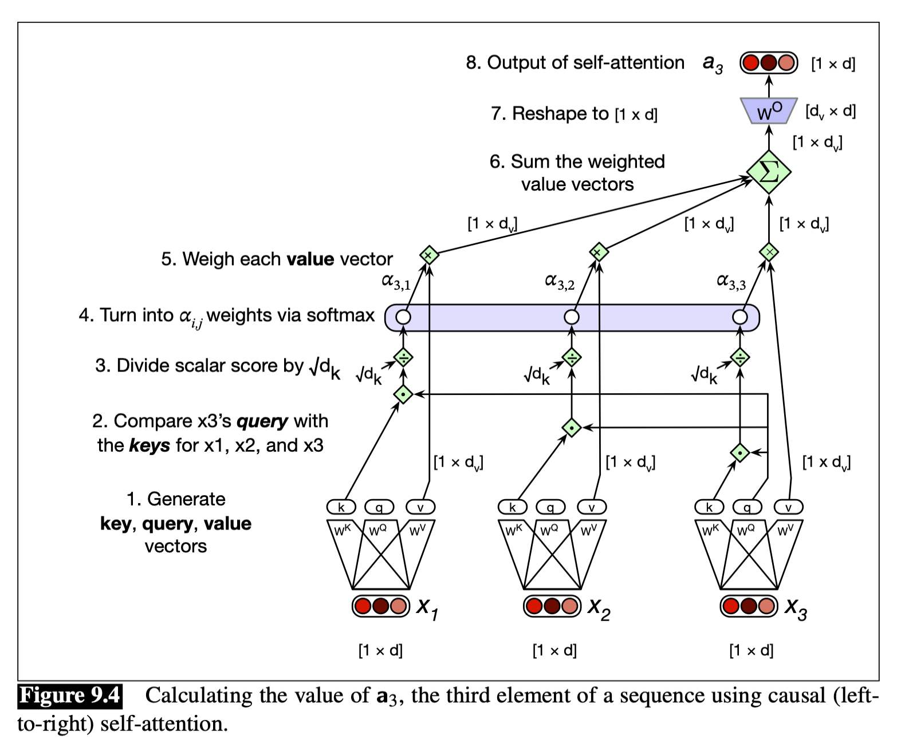
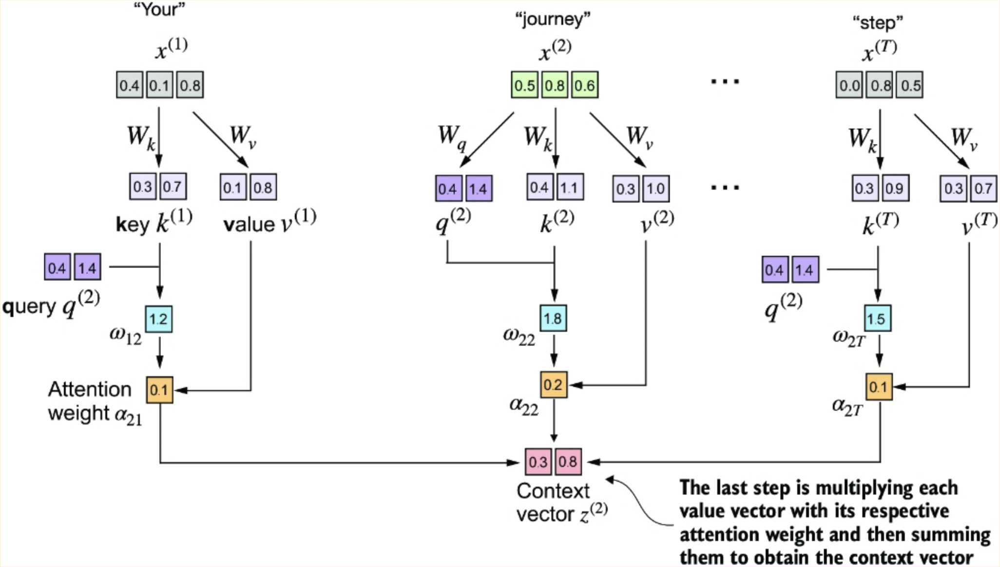

# Notebook for documenting the learning process of this project

## Coding the attention mechanism

"Attention can be thought of as a way to build contextual representations of a token's meaning by **attending to** and integrating information from surrounding tokens, helping the model learn how tokens relate to each other over large spans."
-- Speech and Language Processing. Daniel Jurafsky & James H. Martin.

`attn_weights = torch.softmax(attn_scores, dim=-1)`

The dim=-1 argument applies the softmax normalization along the **last** dimension of a tensor. For a two dimensional tensor, this would normalize *across* the columns to each row sums to 1.

The self-attention mechanism used in the original transformer architecture is also called **scaled dot-product attention**.

### Self-attention with trainable weights

Each input embedding plays 3 roles simultaneously:

**query**: the input embedding vectors role as the current element being compared to the preceding inputs.

**key**: the input embedding vectors role as a preceding input that is being compared to the current element to determine a similarity weight.

**value**: the input embedding vectors role as a value of the preceding element that gets weighted and summed up to compute the output for the current element.

`torch.nn.Parameter(torch.rand(d_in, d_out), requires_grad=False)`

set require_grad=False to reduce output clutter in building. Change to True to update the weight matrices during model training.

Image citation: Daniel Jurafsky and James H. Martin. 2025. Speech and Language Processing: An Introduction to Natural Language Processing, Computational Linguistics, and Speech Recognition with Language Models, 3rd edition. Online manuscript released January 12, 2025. https://web.stanford.edu/~jurafsky/slp3.

#### Calculating the attention weights

This is an important line to break down:

`attn_weights_2 = torch.softmax(attn_scores_2 / d_k**0.5, dim=-1)`

What we are doing here is converting the **attention scores** to an **attention weights**. We do this do this by dividing the attention scores vector `attn_scores_2` by the square root of the dimension of the `keys` vector. This is called **"scaled dot-product attention"** in the original "Attention Is All You Need" paper. 

"The reason for the normalization by the embedding dimension size is to improve the training performance by avoiding small gradients. For instance, when scaling up the embedding dimension, which is typically greater than 1,000 for GPT-like LLMs, large dot products can result in very small gradients during backpropagation due to the softmax function applied to them. As dot products increase, the softmax function behaves more like a step function, resulting in gradients nearing zero. These small gradients can drastically slow down learning or cause training to stagnate."

Raschka, Sebastian. Build a Large Language Model (From Scratch) (Function). Kindle Edition. 

--> Deeper dive for another time: need to understand the "vanishing gradient."

#### Compute the context vector

What exactly is the context vector?

"At its heart, attention is really just a weighted sum of context vectors, with a lot of complications added to how the weights are computed and what gets summed." -J&M

"For each position in a sequence, its corresponding context vector represents that token's "understanding" of the entire sequence." -Claude 3.7 Sonnet

The context vector is simply a weighted sum over the value vectors—with the weighting being done by the attention weights.

Image citation: Raschka, Sebastian. Build a Large Language Model (From Scratch) (Function). Kindle Edition.

From this process, we can generalize to compute to context vectors for the entire input sequence.

### Causal self-attention

Casual self-attention is also known as masked self-attention. The key idea is that we take the attention weights for an input token and restrict the model to only consider **previous and current inputs** when processing any given token when computing attention scores.

This process is fairly straightforward in that all we need do is create a mask matrix that is 1s below the diagonal and 0s above. We then multiply our attention weights by the mask and renormalize each row. One important point to note is that the renormalization does not leak any information due to the mathematics of the softmax function.

"The mathematical elegance of softmax is that despite initially including all positions in the denominator, after masking and renormalizing, the effect of the masked positions is nullified—they don’t contribute to the softmax score in any meaningful way."

Raschka, Sebastian. Build a Large Language Model (From Scratch) (Function). Kindle Edition.
