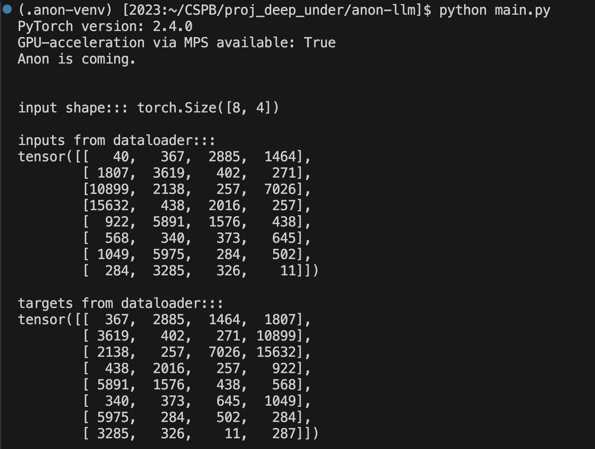
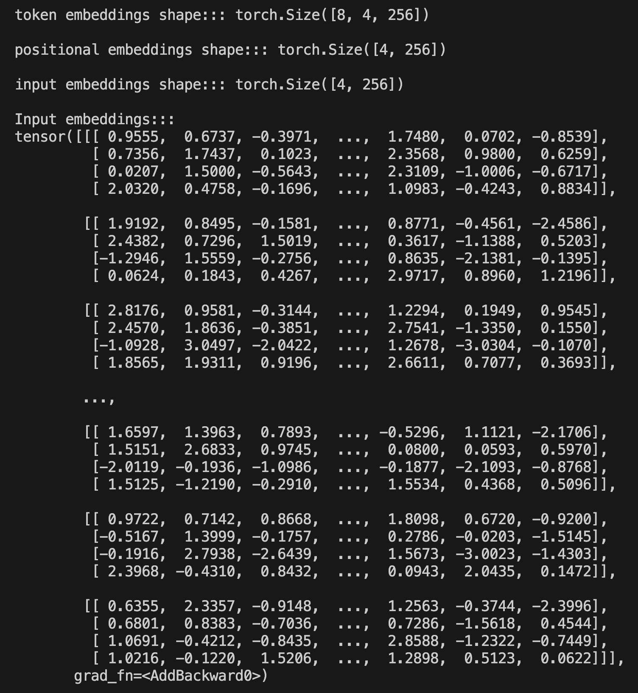
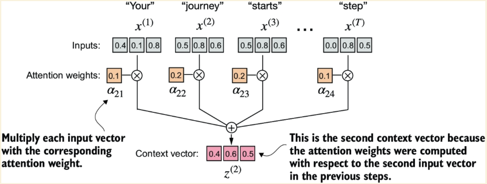
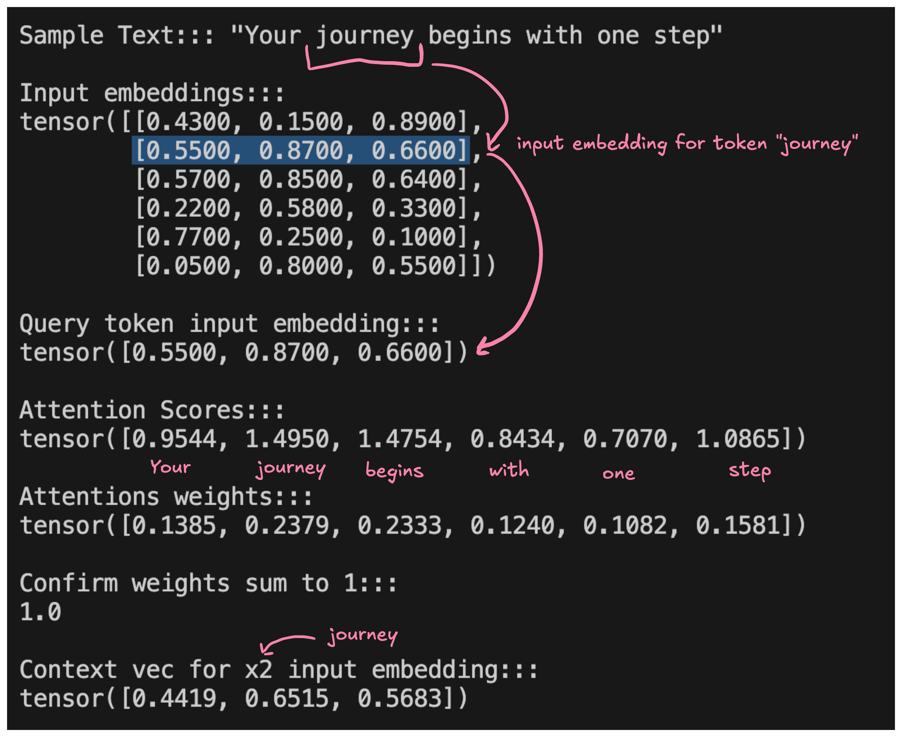
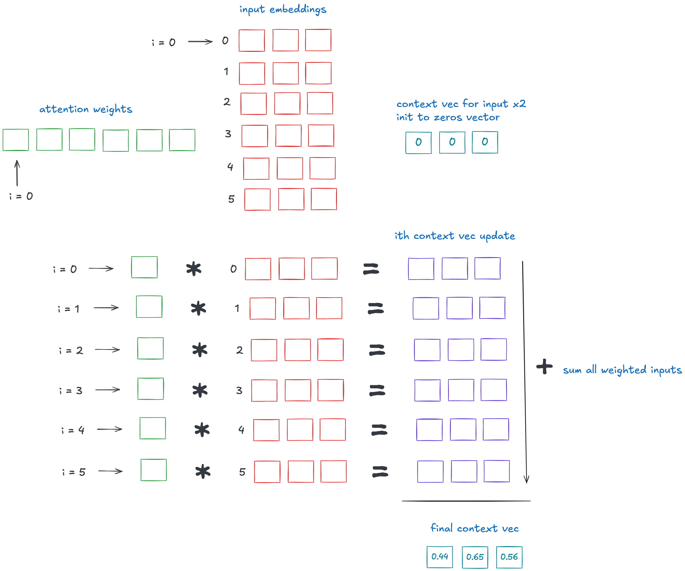

# Project Updates

### Week 3:
#### What did you do last week?
I spent this past week doing a search for some additional resources and then put together the project proposal. I also setup a project Trello board with some initial tasks and built a simple time-tracking spreadsheet.

#### What do you plan to do this week?
This week, I plan to start implementing on the timeline laid out in the proposal. I plan to:
* Read the BaLLM appendix on PyTorch
* Setup a suitable Docker Dev Container with all of the tools I'll need
* Get a "hello world" type program running in the new environment to make sure everything is working

#### Are there any impediments in your way?
I've found that environment setup can end up taking far longer than expected sometimes. I've only started using Docker in the past few months, so there may be some technical obstacles that I will have to overcome. PyTorch is a very well-supported library, though, so I'm sure there will be ample documentation if I need to troubleshoot.

#### Reflection on the process you used last week, how can you make the process work better?
This past week, I basically saved all of my work—with the exception of some early week planning—for Thursday night. While it's nice to have a dedicated time block to work on this project, I think going forward, I would like to break the work up a bit more throughout the week if possible.

### Week 4:
#### What did you do last week?
This week was all about getting my dev environment setup and getting familiar with PyTorch. As expected, this setup processes ended up being more time consuming than expected. I initially planned to use a Docker Dev Container in VS Code to get more practice with Docker, but after successfully creating a container, I realized I couldn’t use my MacBook Pro M3 GPU from inside Docker. Since GPU support is essential for training my LLM, I decided to scrap Docker and develop locally instead.

Switching to a local environment turned out to be straightforward:
* Used `pyenv` to download Python 3.10 (as recommended for PyTorch)
* Set this as the local version in my project directory
* Created a .venv and installed `pytorch` and `numpy` (keeping dependencies minimal)
* Added a main.py file
* Tested the environment using a supplementary script from BaLLM to confirm everything is working

#### What do you plan to do this week?
The plan for this coming week is to understand the architecture of LLMs. I plan to:
* Read the first chapter of BaLLM
* Read the paper "Attention is all you need."
* Start watching Andrej Karpathy's "Let's Build GPT" tutorial

The main goal this week is to get a high-level conceptual understanding for how LLMs work so I can better understand what exactly I will be building.

#### Are there any impediments in your way?
None at the moment.

#### Reflection on the process you used last week, how can you make the process work better?
Unfortunately, I was quite sick for a couple of days, which impacted my productivity. Considering the circumstances, I’m pleased with what I managed to accomplish. Hopefully, this week will be more productive.

### Week 5:
#### What did you do last week?

I spent this past week getting up to speed on transformers and the GPT architecture. I read the first chapter of BaLLM, the seminal paper on transformers, "Attention is all you need," and got about a quarter of the way through Andrej Karpathy's "Let's Build GPT" tutorial.

I also spent a fair amount of time building out my portfolio. Since this project is intended to be a portfolio piece, it makes sense to spend some time building out the rest of my portfolio to present it in the best possible light.

#### What do you plan to do this week?

This coming week, I plan to work through chapter 2 of BaLLM, which focuses on understanding how to work with text data. I also want to set up the environment a bit more and continue working through the Karpathy tutorial. A stretch goal for this coming week is to look into the coding work for the attention mechanism and potentially start setting up some of the scaffolding.

#### Are there any impediments in your way?

None at the moment.

#### Reflection on the process you used last week, how can you make the process work better?

For the last three weeks, I've basically been doing all of my work during a single 4-hour period on Thursday night. While this has been working in terms of staying on track, I'm finding the time block to be a bit constrained—there's just more that I want to work on. This week, I'm going to try breaking up the work into two 2-3 hour blocks to see if that allows me to be more productive and revisit specific points that I want to follow up on.

### Week 6-7:
#### What did you do last week?

It's been a rough two weeks. A bunch of things ended up coalescing on my schedule at once, so I ended up not being able to make any progress in week 6, which was a bummer. But I was able to carve out some time this past week and am finally into the build phase, which feels good. At this stage, I'm basically just following along with the BaLLM book in a more tutorial-like style. I set up a preprocessing pipeline that takes in a single text, converts it to individual tokens using regex, creates a unique vocabulary, and then assigns each token a unique token ID.

#### What do you plan to do this week?

Next week, I plan to finish the text preprocessing phase by creating token embeddings and encoding word position. If that goes quickly, I will move into coding the attention mechanism.

As luck would have it, we are just now getting into the transformer portion on the NLP course and I am extremely grateful to have that content to lean on for this project. I tend to get overwhelmed by complexity, so having Professor Guinn's lectures to reference in this project have been immensely helpful.

#### Are there any impediments in your way?

Right now, my biggest conceptual hurdle is trying to understand which parts of the BaLLM book simply introduce a concept and which parts I actually need to build and integrate into this project. As I was working through this chapter this past week, there was a point where the author said, "We will be using a more robust preprocessor in our implementation," nothing else was introduced, and the next chapter goes right into coding the attention mechanism. Parsing out exactly what needs to be built is definitely the most difficult challenge I am facing right now.

#### Reflection on the process you used last week, how can you make the process work better?

At this point, I'm just trying to keep my head above water. It looks like things should lighten up a bit next week, so hopefully, I won't be too pressed to get my full 4 hours in.

### Week 8:
#### What did you do last week?

This week I continued to work on the text preprocessing pipeline. I realize that a lot of the work I did last week ended up being unnecessary—which was disappointing. In building along with the BaLLM book, I'm realizing now that the author alternates between educational exercises to better understand the underlying mechanics and implementation of the actual code needed to make the LLM system work. I had been diligently following along with all the examples, but most of that work was unnecessary for the end product—which was disappointing.

Following this, I ended up re-building the tokenization preprocessing pipeline using a BPE tokenizer that I imported from an external library hosted by OpenAI. The library is called `tiktoken` and I utilized the BPE tokenizer used in GPT-2. I then created a simple data sampling sliding window that illustrated the context to next token prediction scheme Anon will be using (oh yeah, I also named my LLM Anon). After implementing this, I realized it was another educational exercise and not a functional final implementation. This sliding window exercise was just a preview for a more complex data loader implementation that utilizes the `Dataset` and `DataLoader` built-in classes from PyTorch. I ended this week learning more about these classes and tensors in general (which I will have to use for the data loader).

#### What do you plan to do this week?

Next week, I plan to finish the data loader—which is the final step in the preprocessing pipeline—and then begin working on building the attention mechanism. I realize I'm falling behind schedule, so I want to try and put in some additional hours this week to get back on track.

#### Are there any impediments in your way?

I need to decide how much time I want to devote to working through the educational exercise in the BaLLM book. I find the exercises very helpful for comprehension and understanding in terms of what I'm building, but they also take up a lot of time and don't contribute to my overall progress on the project. It's tough to know if I should "go slow to go fast" (i.e., take the time to deeply understand what I'm building to make the development process easier down the line) or charger ahead with the main components with a potentially less deep understanding of what I'm actually building. My normal style would be to go for the depth of understanding; however, I worry this will likely result in running out of time to fully complete the project.

#### Reflection on the process you used last week, how can you make the process work better?

I really want to try to break up my time block for this project into two periods next week. I keep saying I am going to do this, but then other obligations get in the way and I end up doing all of my work during a single time block. It seems like I have a little slack in my schedule this week though so I think I should be able to switch things up and see how it goes.

### Week 9:
#### What did you do last week?

I finally finished the preprocessing pipeline! The pipeline has a custom PyTorch Dataset class that processes raw text into overlapping "chunks" using a sliding window approach. It then tokenizes the text using the GPT-2 tokenizer, embeds the token in an embedding vector and then concatenates this with a positional vector—resulting in the final input embeddings that are ready to be passed into the transformer attention mechanism. Here are some screenshots of the interim output:

#### What do you plan to do this week?

Next week I will get started on building the attention mechanism. I'm pretty excited for this part.

#### Are there any impediments in your way?

Nothing right now. Feels good to have achieved a tangible milestone.

#### Reflection on the process you used last week, how can you make the process work better?

Still stuck in the 4 hour block on Thursdays. I was actually able to get closer to 5 this week with the project proposal write up. I'm starting to think the 4 hours of deep work might actually be more desirable than attempting to break up the work period. There's something to be said for getting loaded into a project and going into flow state.

### Week 10:
#### What did you do last week?

This week I entered the belly of the beast—coding the transformer attention mechanism. In doing a first skim through the chapter, I will say I'm a little intimidated about the portion of the project. Luckily though, the BaLLM tutorial takes things one step at a time which definitely helps calm my "complexity anxiety."

This week ended up being very heavy on conceptual understanding. I spent a lot of my time whiteboarding the concepts that were being explained/coded. In the end, I was able to implement and conceptually wrap my head around a context vector and how it is computed. The three images below essentially mirror the process I went through this week–study the concept in the book, implement the concept in the code, whiteboard the concept to fully understand what each line of code is doing.

Raschka, Sebastian. Build a Large Language Model (From Scratch) (p. 124). (Function). Kindle Edition.

There is a lot going on in what amounts to not very many lines of code, so I feel like it's crucial to understand exactly what each line is doing so I don't get lost later on down the road.

#### What do you plan to do this week?

Next week and over the break I'm going continue building the self-attention mechanism. I'm hoping that once I fully understand the fundamentals of the attention mechanism, the rest of this portion of the project will go a bit more quickly. With some extra time over the break, I'm setting a stretch goal to have the attention mechanism completed by April 3rd.

#### Are there any impediments in your way?

Nothing specifically right now. Just trying not to get too overwhelmed by the complexity and continuing to focus on one step at a time.

#### Reflection on the process you used last week, how can you make the process work better?

I decided to really slow down and focus on conceptual understanding this week. This is a complex portion of the project, so I think it is worth spending a bit more time now rather than charging ahead without a solid grasp on what exactly it is that I'm building.